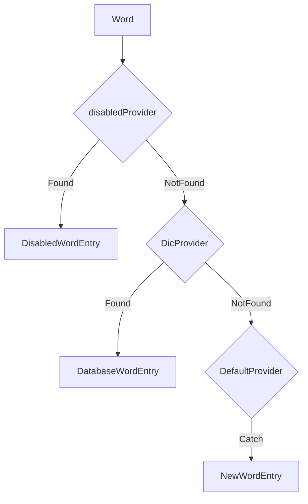

# Interface Design


## WordProvider

on the project, there exists three cases of a word from raw text. They are:

- **DisabledWords** Which is easy and not need to explain. You can add or delete by command `termhelper config`

- **StoredWords** Which has been explained last and pushed into database so that it's no need to parse it again. It depends on the database.

- **NewWords** Which is brand new and all need to be explained on the loop.

For handle three types, I write a interface as below

```go
type WordProvider interface {
	provide(word string) (entry *models.WordEntry, found bool)
}
```

The privide function receive the word string and return a WordEntry which is 

```go
type WordEntry struct {
	Word string `storm:"id"`

	SimpleDefinition    string
	DetailedExplanation string

	Proficiency float32 `storm:"index"`

	NextReviewTime int64 `storm:"index"`
}
```

And three type WordProvider designed for three types of words.

- **DisabledProvider**

The provider store disabledWords as slice. When word matched, it return a word with high proficiency so this word will not be pushed into database.

```go
type DisabledProvider struct {
	disabledWords []string
}
// disabledWords provide
// This function provide word Entry with All attributes empty
// Mark this as disabledProficiency so that it will not display
func (dp *DisabledProvider) provide(word string) (entry *models.WordEntry, found bool) {
	if slices.Contains(dp.disabledWords, word) {
		return &models.WordEntry{
			Word:                word,
			SimpleDefinition:    models.EmptyStr,
			DetailedExplanation: models.EmptyStr,
			Proficiency:         disabledProficiency,
			NextReviewTime:      time.Now().Unix(),
		}, true
	}
	return nil, false
}
```

- **DicProvider**

The provider hold WordData pointer and it's provide function return the WordEntry if this word exist on database otherwise ErrNotFound.

```go
type DicProvider struct {
	wordData *storage.WordData
}
// DicProvider provide
// This provide func query this word from database then return entry
func (dp *DicProvider) provide(word string) (entry *models.WordEntry, found bool) {
	// if the wordData init failed, wordData will be nil
	if dp.wordData == nil {
		return nil, false
	}

	// default found, if not found, reset it as false
	found = true
	var err error

	entry, err = dp.wordData.GetWordEntryByStr(word)

	if err == storm.ErrNotFound {
		found = false
	}

	return
}
```

- **defaultProvider**

The provider returns a new WordEntry with InitProficiency and empty definition. It will return found = false so that system will mark the word as new.

```go
type defaultProvider struct{}
// defaultProvider provide
// Just not forbidden words or not found on database words will enter this provide
// So return found = false
func (np *defaultProvider) provide(word string) (entry *models.WordEntry, found bool) {
	return &models.WordEntry{
		Word:                word,
		SimpleDefinition:    models.EmptyStr,
		DetailedExplanation: models.EmptyStr,
		Proficiency:         models.InitProficiency,
		NextReviewTime:      time.Now().Unix(),
	}, false
}

```


## Combine Three Providers

The pushWord function will preprocess all words in chunk. Then marks new words so that system will send it to LLM provider later.

It just tranverse the providers slices.

```go
// pushWord This function tranverse all providers
// Words can comes from
// NOTE:
// disabledProvider : When the word is disabled
// dicProvider 		: When the word exists on the database
// defaultProvider  : When the word is brand new for termhelper
func (c *Chunker) pushWord(word string) {
	cleanWord := strings.Trim(strings.ToLower(word), ".,!?;:()\"'")
	// if it's not word, return
	if cleanWord == "" || len(cleanWord) < 2 {
		return
	}

	var wordEntry *models.WordEntry
	var found bool

	for idx := range c.providers {
		wordEntry, found = c.providers[idx].provide(cleanWord)

		if found {
			break
		}
	}
	
	// When the word is catched by defaultProvider
	// The finnally found bool == false
	if !found {

		c.pushNewWord(wordEntry)
		return
	}

	c.pushExistWord(wordEntry)
}
```

And the chunker initiailized by the sequence of providers.

```go
func NewChunker(text string) *Chunker {
	fmt.Println("disabled words:")
	fmt.Println(config.GetGlobalConfig().WordProvider.DisabledWords)

	fmt.Println()

	return &Chunker{
		rawText: text,

		maxWordCount: defaultMaxWords,
		maxCharCount: defaultMaxChars,

		allWords: models.WordStore{
			Entries:    []*models.WordEntry{},
			IndexMap:   map[string]int{},
			IsNewMap:   map[string]bool{},
			NewInDices: []int{},
		},

		currPos:      0,
		contextStart: 0,

		providers: []WordProvider{
			// disabled provider return the word entry with hight proficiency to avoid displaying them
			newDisabledProvider(config.GetGlobalConfig().WordProvider.DisabledWords),

			// dic provider which Get words from dicts
			newDicProvider(),

			// default provider for new words construct
			newDefaultProvider(),
		},
		currChunkPos: 0,
		chunkCache:   []*models.Chunk{},
	}
}

```

As we can see, it will work like a **filter** as below




## LLMClient

```go
type LLMClient interface {
	// Explain function explain words on the chunk and return Results which can be parased and push to database
	Explain(ctx context.Context, chunk *models.Chunk) (response *models.LLMExplainResults, err error)

	// Ping function test if this LLM Provider is available
	// Just check the network
	Ping(ctx context.Context) error
}
```

And there are deepseekClient and ollamaClient available now. openai is todo (Maybe never done). So We can just add a new provider and add it into config.toml and GetClient function

```go
func GetClient() (client LLMClient, err error) {
	if !config.HasNextProvider() {
		return nil, fmt.Errorf("there is no available provider")
	}

	for {
		nextProviderStr, _ := config.NextProviderStr()

		switch nextProviderStr {
		case models.OllamaClientStr:
			client = newOllamaClient()
		case models.DeepSeekClientStr:
			client = NewDeepSeekClient()
			// TODO: OpenAI client (Optional)
		}

		ctx, cancel := context.WithTimeout(context.Background(), 10*time.Second)

		defer cancel()

		err = client.Ping(ctx)
		if err == nil {
			return
		} else {
			output.Console.Info("fail to ping model provider, try next", "provider", nextProviderStr, "err", err)
			output.File.Info("fail to ping model provider, try next", "provider", nextProviderStr, "err", err)
		}

	}
}
```


